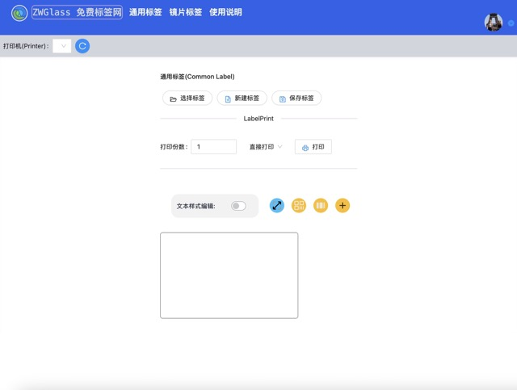
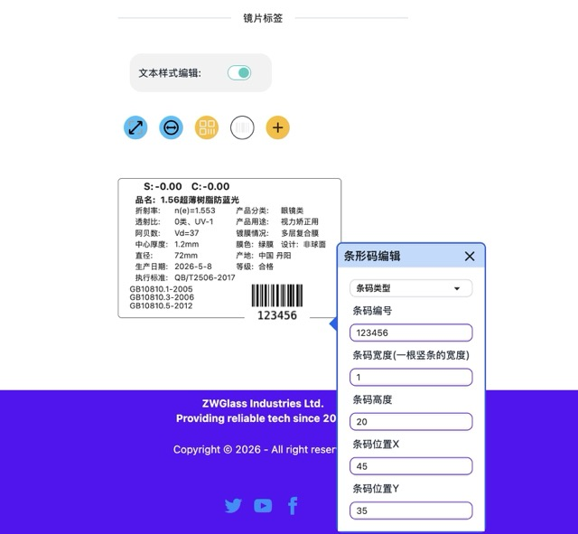
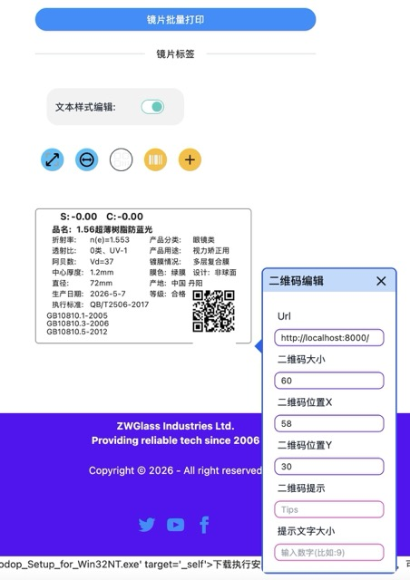
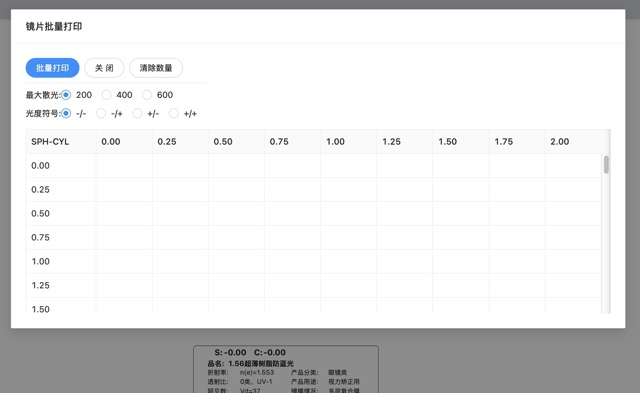

# ZWGlass Label Print

Free online label printer, an open alternative to paid label design software.

Live demo: https://label.zwglass.net

ZWGlass Label Print is a browser-based label printing tool for small businesses, warehouses, optical shops, and teams that need barcode labels, QR code labels, and eyeglass lens labels without paid desktop software. It supports browser printing, JSON template export, and optional LODOP/C-Lodop local printer integration.

中文：免费在线标签打印工具，平替收费标签打印软件。

Keywords: free online label printer, online label printer, free label printing software, label design software alternative, barcode label printer, QR code label printer, browser-based label printing, printable label maker, custom label printer online, eyeglass lens label printer, optical shop label printing, lens label printing, LODOP web printing, C-Lodop browser printing, 免费标签打印, 在线标签打印, 标签打印软件平替

## Screenshots









## Use Cases

- Small businesses: print product labels, price labels, shelf labels, and QR code labels.
- Warehouses and ecommerce sellers: print inventory labels, barcode labels, package labels, and bin labels.
- Optical shops and lens labs: print eyeglass lens labels and batch lens parameter labels.
- Lightweight office workflows: create quick labels without installing complex paid label printing software.
- Browser printing systems: use browser print preview by default, or connect to local printers through LODOP/C-Lodop.

## Features

- Free online label printing.
- Common label editor: `/`
- Eyeglass lens label editor: `/lens/`
- Printing guide and LODOP setup page: `/contact/`
- Editable label text, font size, bold style, rotation, and position.
- Editable label width and height.
- QR code and barcode label support.
- Lens label creation, center thickness and diameter editing, and batch printing.
- Browser local storage for label templates.
- JSON template export for backup and migration.
- Browser print preview and browser printing.
- Optional LODOP/C-Lodop printer detection and direct local printing.
- SEO/AEO/GEO foundation: metadata, structured data, `robots.txt`, `sitemap.xml`, and `llms.txt`.

## How It Works

Open the live demo:

```text
https://label.zwglass.net
```

Basic workflow:

1. Create or select a label.
2. Edit text, QR code, barcode, or lens parameters.
3. Set the label size and print quantity.
4. Use browser print preview, or install LODOP/C-Lodop to select a local printer.
5. Save the template locally and export JSON for backup.

## FAQ

### Is ZWGlass Label Print free?

Yes. ZWGlass Label Print is a free online label printer and a lightweight alternative to paid label design software.

### Can it replace paid label printing software?

It can cover lightweight label printing workflows such as product labels, barcode labels, QR code labels, inventory labels, and eyeglass lens labels. Enterprise workflows such as centralized approvals, permission management, and advanced template governance may require additional backend integration.

### Do I need to install LODOP/C-Lodop?

No. Browser printing and print preview work without plugins. LODOP/C-Lodop is optional and is useful when a web page needs to read local printers and send direct print jobs.

### Where are label templates stored?

Templates are saved in browser `localStorage` by default. You can also export JSON files to back up templates or move them to another browser or computer.

### Does it support eyeglass lens label batch printing?

Yes. The `/lens/` page can create eyeglass lens labels, edit lens parameters, center thickness, and diameter, and batch print multiple lens label combinations.

## Chinese Summary

ZWGlass Label Print 的宗旨是“免费标签打印，平替收费标签打印软件”。它支持通用标签、二维码标签、条形码标签、眼镜片标签、浏览器打印和 LODOP/C-Lodop 本地打印机集成。

## Tech Stack

- Next.js 14
- React 18
- Bun
- Tailwind CSS 4
- daisyUI 5

## Project Structure

```text
.
├── next.config.js          # Next.js config with static export
├── package.json            # Dependencies and scripts, using Bun
├── bun.lock                # Bun lockfile
├── public/                 # Static assets, icons, llms.txt
├── src/
│   ├── app/                # Next.js App Router pages
│   ├── components/         # UI and label editing components
│   └── lib/                # Label models, local storage, SEO config
├── docs/                   # API notes and marketing/SEO plan
└── tmp_imgs/               # README screenshots and development references
```

## Requirements

Install Bun:

```bash
curl -fsSL https://bun.sh/install | bash
```

Check the version:

```bash
bun --version
```

Current project version:

```text
bun@1.3.13
```

## Install

```bash
bun install
```

## Environment Variables

Copy the example config:

```bash
cp .env.example .env.local
```

Common config:

```text
NEXT_PUBLIC_API_BASE_URL=http://127.0.0.1:8000
NEXT_PUBLIC_LODOP_DOWNLOAD_URL=https://label-1254307677.cos.ap-chengdu.myqcloud.com/zip_files/CLodop_Setup_for_Win32NT.exe.zip
NEXT_PUBLIC_SITE_URL=http://localhost:3000
```

Client-visible variables must use the `NEXT_PUBLIC_` prefix. Do not put backend secrets, database passwords, or private keys in these variables.

Before production builds, set `NEXT_PUBLIC_SITE_URL` to the public domain:

```text
NEXT_PUBLIC_SITE_URL=https://label.zwglass.net
```

This value is used for canonical URLs, Open Graph URLs, `sitemap.xml`, `robots.txt`, and structured data.

## Local Development

```bash
bun run dev
```

Default URL:

```text
http://localhost:3000
```

Custom host and port:

```bash
bun run dev -- --hostname 127.0.0.1 --port 3000
```

## Build

```bash
bun run build
```

Static files are generated in:

```text
out/
```

## Production

This project uses static export:

```js
output: "export"
```

Deploy the `out/` directory to Nginx, static hosting, GitHub Pages, object storage, or another static web host.

To preview the static build locally:

```bash
bunx serve out
```

## Marketing and Search

The project follows early-stage distribution ideas from [Marketing for Founders](https://github.com/EdoStra/Marketing-for-Founders), with an emphasis on SEO, AEO, GEO, free-tool marketing, and directory/community launches.

Current foundations:

- English-first page titles, descriptions, canonical URLs, Open Graph, and Twitter metadata.
- `SoftwareApplication`, `FAQPage`, `HowTo`, and `BreadcrumbList` structured data.
- `/robots.txt`, `/sitemap.xml`, and `/llms.txt` for search engines and AI crawlers.
- Answer-style page content for online label printing, barcode labels, QR code labels, eyeglass lens labels, and LODOP/C-Lodop browser printing.

Marketing execution plan:

```text
docs/marketing_seo_aeo_geo_plan.md
```

## Notes

- Label templates are saved in browser `localStorage` and can be exported as JSON files.
- Printing uses `window.print()` as the reliable browser fallback. If `LODOP` or `CLODOP` exists in the browser environment, the printer selector attempts to read local printers.
- `tmp_imgs/` is used for README screenshots and development references.
